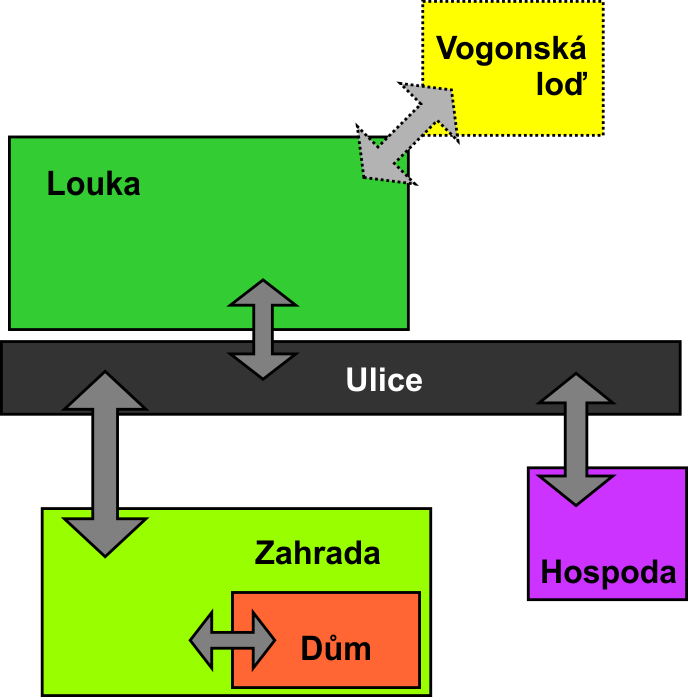

# Zachraň Arthura Denta

- Semestrální projekt k předmětu 4IT101 - Adventura
- Datum: 16.1.2013
- Autor: Jiří Hudec

----------

## Popis
Jedná se o adaptaci úvodních kapitol románu Douhlase Adamse Stopařův průvodce galaxií.  
Hráč ovládá postavu Forda Prefecta, který se snaží zachránit svého přítele Arthura Denta z planety Země, která je odsouzena k demolici kvůli výstavbě hyperprostorové expresní dálnice. Jeho cílem je spolu s Arthurem nastoupit na jednu z Vogonských lodí dříve než bude Země zničena. Při tom musí překonat nejedno úskalí a překážku...

----------

## Průběh hry
Hra se snaží co nejvěrněji držet knižní předlohy, resp. jejího českého vydání. Její znalost výrazně usnadňuje její dokončení.  
V poslední třetině hry jsou zavedena omezení na počet možných zadaných příkazů a uplnulý reálný čas. 

----------

## Plán hry
Hráč začíná v prostoru **Louka**  

----------

## Herní příkazy
### Arthur
**Použití:** arthur *název_povelu*  
**Popis:** Umožňuje dávat Arthurovi povely. Arthur vyková tyto příkazy: 

- *inventář* - vypíše obsah svého inventáře
- *následuj* - začne následovat Forda při pohybu prostory
- *stůj* - zastaví se v aktuálním prostoru

### Jdi
**Použití:** jdi *název_prostoru*  
**Popis:** Přesun postavy mezi herními prostory.
### Konec
**Použití:** konec  
**Popis:** Předčasně ukončí hru.
### Nápověda
**Použití:** ?   
**Popis:** Vypíše nápovědu.
### Polož
**Použití:** polož *předmět_z_tašky*  
**Popis:** Položí předmět z hráčovy tašky do aktuálního prostoru.
### Použij
**Použití:** použij *předmět_z_tašky*  
**Popis:** Použije vybraný předmět z hráčovy tašky. Použití některých předmětů je klíčové, jiné slouží jako nepovinné zpestření.
### Promluv
**Použití:** promluv *jméno_osoby*  
**Popis:** Zahájí rozhovor s postavou daného jména. Rozhovory jsou klíčovou součástí hry, nezbytnou pro její dokončení.
### Předej
**Použití:** předej *předmět_z_tašky* *jméno_osoby*    
**Popis:** Předá předmět z hráčovy tašky do inventáře osoby daného jména
### Seber
**Použití:** seber *předmět_z_prostoru*  
**Popis:** Sebere předmět z aktuálního prostoru a pokud je to možné, tak vloží do hráčovy tašky.
### Vezmi
**Použití:** vezmi *požadovaný_předmět_od_osoby* *jméno_osoby*  
**Popis:** Vezme předmět z inventáře dané osoby a pokud je to možné tak vloží do hráčovy tašky.  
  
Poznámka k příkazům Předej a Vezmi: Některé předměty po vložení do inventáže osob už nejdou zpět vzít, nebo se v inventáži mohou objevovat nové předměty.

----------

## Nápověda pro průchod hrou
Pro dokončení hry je důležité provést tyto kroky:

- Najít Arthura a přesvědčit ho, aby Forda následoval
- Zajít s Arthurem do hospody na pivo
- Koupit buráky
- Obstarat Arthurovi ručník
- Odstopovat Vogonskou loď